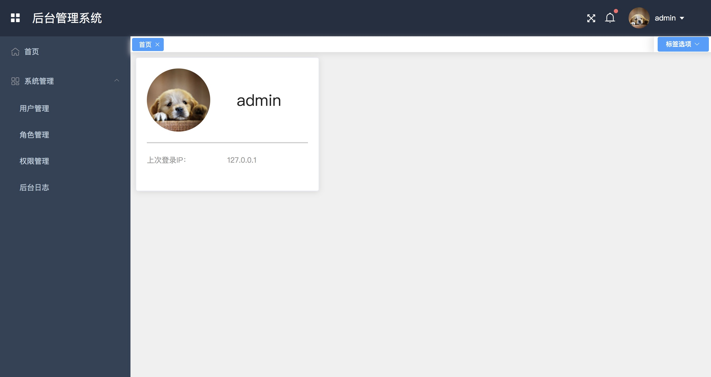

# 后台管理系统 #

    基于 Vue2 （vue cli3）和 Element-UI，构建后台管理系统

## 安装步骤 ##

	1. npm install	 //安装依赖
	
	2. .env.local //修改配置文件
	
	3. npm run dev 

## 打包 ##

	// 构建项目
	npm run build
	

## 功能介绍 ## 	
	
	1.系统用户管理
	
	2.角色管理以及权限分配
	
	3.权限以及菜单管理
	
	4.后台操作日志
	
	4.左侧菜单动态加载
	
## 技术栈 ##

    vue2.0
    vuex
    element
    
    	
## 项目预览
    
    首页
    	
	